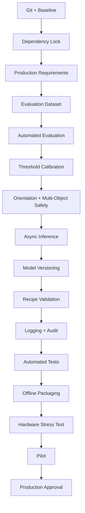

# VisionAI System Diagrams

# Technical Architecture Diagram:
```mermaid
flowchart LR
    subgraph UI["User Interface Layer"]
        direction TB
        UI[ui/inspection/overlay.py]
        SW[ui/inspection/status_widget.py]
        TW[ui/trainer/trainer_window.py]
        RP[ui/trainer/pages/recipe_page.py]
        DP[ui/trainer/pages/dataset_page.py]
        TP[ui/trainer/pages/training_page.py]
        RV[ui/trainer/pages/review_page.py]
        EP[ui/trainer/pages/export_page.py]
    end

    subgraph SV["Service Layer"]
        direction TB
        PS[services/patchcore_service.py]
        IS[services/inference_service.py]
        RS[services/recipe_service.py]
        SS[services/state_manager.py]
        TM[services/top_mark_service.py]
        RI[services/roi_service.py]
        DA[services/dataset_service.py]
        DPR[services/dataset_preparer.py]
    end

    subgraph ML["Machine Learning Layer"]
        direction TB
        PT[models/detection/best.pt]
        PB[models/backbone/wide_resnet50_2/model.safetensors]
        PC[recipes/TJA1041_SO14/model/patchcore.pt]
        PD[recipes/TJA1041_SO14/model/memory_bank.pt]
        PD2[recipes/TJA1041_SO14/model/metadata.json]
    end

    subgraph UT["Utilities"]
        direction TB
        RPATH[utils/resource_path.py]
        IU[utils/image_utils.py]
        PP[utils/paths.py]
    end

    UI --> RS
    SW --> PS
    SW --> RI
    RI --> PT
    PT --> RI
    RI --> PS
    PS --> IS
    IS --> SW
    RP --> RS
    DP --> PS
    TP --> PS
    PS --> PS
    TP --> RV
    RV --> IS
    IS --> RV
    RV --> PS
    PS --> PC
    PS --> PD
    PS --> PD2
    SW --> PP
    PS --> PP
    RS --> PP
    RS --> RPATH

    classDef ui fill:#E3F2FD,stroke:#1976D2,stroke-width:2px;
    classDef service fill:#FFF3E0,rgba(255,82,82,0.2);
    classDef ml fill:#E8F5E9,rgba(76,175,80,0.2);
    classDef util fill:#F3E5F5,rgba(156,39,176,0.2);
```

# User Workflow Diagram:
```mermaid
flowchart TB
    direction LR
    
    START["Launch Application"]:::user
    CHOOSE_RECIPE["Select Recipe/Package"]:::user
    LIVE_INSPECT["Live Inspection Mode"]:::user
    CAPTURE_TEMPLATE["Capture Top-Mark Template"]:::user
    TRAINING["Training Mode"]:::user
    REVIEW["Model Review Mode"]:::user
    EXIT["Close Application"]:::user
    
    TECH_START["Initialize Qt + Load YOLO Model"]
    TECH_RECIPE["Load Recipe + PatchCore Model"]
    TECH_DETECT["YOLO OBB Detection"]
    TECH_ORIENT["Template Matching (0/90/180/270)"]
    TECH_SCORE["PatchCore Anomaly Score"]
    TECH_RESULT["Determine PASS/FAIL/NOT FOUND"]
    
    LIVE_INSPECT --> TECH_START
    TECH_START --> TECH_RECIPE
    TECH_RECIPE --> TECH_DETECT
    TECH_DETECT --> TECH_ORIENT
    TECH_ORIENT --> TECH_SCORE
    TECH_SCORE --> TECH_RESULT
    TECH_RESULT --> LIVE_INSPECT
    
    TRAINING --> TECH_START
    TECH_RECIPE --> TECH_DETECT
    TECH_DETECT --> TECH_ORIENT
    TECH_ORIENT --> TECH_SCORE
    TECH_SCORE --> TRAINING
    
    REVIEW --> TECH_START
    TECH_RECIPE --> TECH_DETECT
    TECH_DETECT --> TECH_ORIENT
    TECH_ORIENT --> TECH_SCORE
    TECH_SCORE --> REVIEW
    
    classDef user fill:#E8F5E9,stroke:#388E3C,stroke-width:2px;
    classDef tech fill:#BBDEFB,rgba(33,150,243,0.2);
```

# Production Approval Gates:


# Key for Diagrams

- **User-Facing Elements** (visible to operators): UI components, user choices, application states, exit/close actions
- **Technical Elements** (for engineers/architects): Service layer classes, model artifacts, utility functions, data flow, approval gate progression
- **Gate Status**: `pending` = not yet completed, `blocked` = production approval not reached, `passed` = completed and verified

---

# Instructions for Viewing

1. Copy any of the Markdown code blocks above into a markdown file (.md)
2. Open the markdown file in a markdown viewer (VS Code, Obsidian, GitHub, GitLab, etc.)
3. Or paste the code into <https://mermaid.live> to render interactively
4. The technical diagram shows component interactions and data flow
5. The user workflow shows the operator's journey through the application
6. The approval gates show the production readiness progression