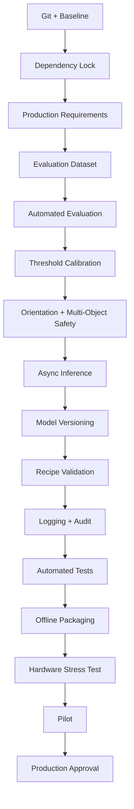

# VisionAI - Production Approval Roadmap

**Last updated**: 2026-08-29

## CURRENT RECOMMENDATION
**Do NOT approve this application for production yet.**

The codebase is now cleaned and restructured, and the inspection/training flow
works on a development machine. However, production approval requires evidence,
repeatability, measured accuracy, and operational safeguards that are not yet
in place.

This document is the checklist the project must pass before production release.

---

## 1. ESTABLISH SOURCE CONTROL

The project currently has no Git repository.

**Actions**:
  - Initialize Git in the project root.
  - Add a `.gitignore` file.
  - Exclude from version control:
      - `__pycache__/`
      - `archive/`
      - `prediction_output/`
      - `results/`
      - `runtime_roi.jpg`
      - `debug_topmark_roi.jpg`
      - local datasets
      - temporary files
      - `*.pyc`
      - `.idea/`
      - `.vscode/`
  - Commit the current working version as the baseline.

**Exit criterion**:
  - The application can be restored exactly from a clean checkout.

---

## 2. FREEZE THE ENVIRONMENT

There is currently no dependency manifest.

**Create**:
  - `requirements.txt` or `pyproject.toml`
  - Locked versions for:
      - Python
      - PyTorch
      - TorchVision
      - Anomalib
      - Ultralytics
      - OpenCV
      - PySide6
      - NumPy
      - Pillow
      - MSS
      - PyGetWindow

**Exit criterion**:
  - `pip install -r requirements.txt` works on a clean offline machine.
  - Offline installation has been tested.

---

## 3. DEFINE PRODUCTION REQUIREMENTS

Write down measurable requirements **BEFORE** changing the model.

**Define numeric targets for**:
  - Maximum false-pass rate
  - Maximum false-fail rate
  - Maximum inspection latency
  - Required inspections per minute
  - Supported Windows versions
  - Supported monitor resolutions
  - Required offline behavior
  - Required model update procedure
  - Required audit information

**Example**:
  - False pass rate: below 0.1%
  - False fail rate: below 2%
  - Total inspection latency: below 500 ms
  - Application availability: above 99%

**Exit criterion**:
  - Quality, speed, and reliability targets are approved by the production owner.

---

## 4. CREATE A PROPER EVALUATION DATASET

The current test data is not a formal validation set.

**Separate data into labeled groups**:
  - Training-good images
  - Validation-good images
  - Defective IC images
  - Upside-down IC images
  - Wrong-package images
  - Missing or partially visible IC images
  - Difficult lighting and positioning cases

**Keep validation data STRICTLY separate from training data.**

**Exit criterion**:
  - Every test image has a known expected result and defect category.
  - No evaluation image is also used for training.

---

## 5. BUILD AN AUTOMATED EVALUATION TOOL

Create a repeatable evaluation script that reports:
  - YOLO detection precision and recall
  - Orientation accuracy
  - PatchCore precision and recall
  - False-pass count
  - False-fail count
  - Confusion matrix
  - Average and worst-case latency
  - Memory usage

**Do not rely on manually looking at console output.**

**Exit criterion**:
  - One command produces a complete evaluation report.

---

## 5. FIX AND CALIBRATE THRESHOLDS

The current recipe contains:

    "anomaly_threshold": 60

PatchCore scores must be measured and calibrated against real validation data.
Do not assume that `0.60` or `60` is correct.

**Define separate thresholds for**:
  - YOLO detection confidence
  - Orientation match score
  - Orientation score gap
  - PatchCore image score
  - Pixel/anomaly-map visualization

**Exit criterion**:
  - Thresholds are based on measured validation performance.
  - Threshold values and units are documented.
  - No production decision uses an arbitrary default.

---

## 7. MAKE ORIENTATION DETECTION SAFE

The current orientation logic chooses the best of 0, 90, 180, and 270 degrees.

**It still needs**:
  - Minimum template match score
  - Minimum best-versus-second-best score gap
  - `UNKNOWN` result for ambiguous matches
  - Fail-safe behavior for missing templates
  - Tests for rotated, blurred, cropped, and low-light images

**Exit criterion**:
  - Ambiguous or invalid orientation checks never result in an unintended PASS.

---

## 8. HANDLE DETECTION COUNTS CORRECTLY

The application currently displays the number of detected objects but inspects
only `boxes[0]`.

**Define expected behavior**:
  - Zero ICs: `NOT FOUND`
  - One IC: inspect it
  - More than one IC: fail or inspect each one
  - Wrong number of ICs: explicit production error

**Exit criterion**:
  - Every detected IC is either inspected or explicitly rejected with a reason.

---

## 9. SEPARATE INFERENCE FROM THE UI THREAD

YOLO and PatchCore inference currently run from the Qt timer path.
On onboard graphics or CPU-only hardware this can freeze the UI and create
unpredictable latency.

**Move capture and inference to**:
  - A worker thread, or
  - A dedicated inference process

**Add**:
  - Frame throttling
  - Queue limits
  - Timeout handling
  - Cancellation
  - Measured stage timings

**Exit criterion**:
  - The UI remains responsive during slow inference.
  - Inference never processes an unbounded queue.
  - Worst-case latency is within the production requirement.

---

## 10. STANDARDIZE MODEL LOADING

The project has had multiple model formats:
  - `patchcore.pt`
  - `memory_bank.pt`
  - Anomalib exported models
  - Lightning checkpoints
  - Duplicate backbone files

**Choose one supported format and create a model manifest containing**:
  - Model version
  - Package type
  - Backbone
  - Training date
  - Dataset identifier
  - Preprocessing settings
  - Image size
  - Thresholds
  - Memory-bank shape
  - Software version

**Exit criterion**:
  - A model can be validated and loaded without relying on undocumented
    file conventions.

---

## 10. IMPLEMENT MODEL VERSIONING AND ROLLBACK

Never overwrite the active model directly.

**Use a structure such as**:

    recipes/
      TJA1041_SO14/
        recipe.json
        models/
          v001/
          v002/
        active_model.json

**Support**:
  - Activate model
  - Deactivate model
  - Roll back model
  - Validate model before activation
  - Preserve the previous working model

**Exit criterion**:
  - A failed model update can be rolled back without reinstalling the
    application.

---

## 11. HARDEN RECIPE MANAGEMENT

Recipes currently have inconsistent fields such as:
  - `model_path`
  - `anomaly_model`
  - `memory_bank_path`
  - `model.path`

**Actions**:
  - Define one schema.
  - Validate required fields.
  - Validate numeric ranges.
  - Validate package metadata.
  - Reject duplicate or invalid recipe names.
  - Resolve model paths consistently.
  - Use atomic JSON writes.
  - Add recipe backups.

**Exit criterion**:
  - A malformed recipe cannot crash the inspection loop or cause an
    accidental PASS.

---

## 12. IMPROVE DATASET PREPARATION

The trainer should validate:
  - Corrupt images
  - Duplicate filenames
  - Duplicate images
  - Empty ROIs
  - Extremely small ROIs
  - Blurry images
  - Incorrect aspect ratios
  - Insufficient sample count
  - Inconsistent image resolutions

**The current fixed geometry tolerances should be configurable and justified.**

**Exit criterion**:
  - Training cannot start unless the dataset passes validation.

---

## 13. FINISH OR REMOVE PLACEHOLDER FEATURES

The following are still placeholders:
  - Model recommendation
  - Physical analysis
  - Export page
  - `AnalysisService`
  - Some trainer UI behavior

**Choose one**:
  1. Implement them fully.
  2. Remove them from the production UI.
  3. Clearly label them as unavailable.

**Exit criterion**:
  - No production screen displays fake model similarity, fake physical
    analysis, or misleading status information.

---

## 14. ADD PRODUCTION LOGGING AND AUDIT RECORDS

Replace scattered `print()` calls with structured logging.

**Record for every inspection**:
  - Timestamp
  - Recipe name and version
  - Model version
  - Detection confidence
  - Orientation result
  - PatchCore score
  - Threshold
  - Final result
  - Failure reason
  - Processing latency
  - Source/image identifier

**Avoid saving every frame. Save only**:
  - Failed inspections
  - Unknown results
  - Operator-requested samples
  - Periodic diagnostic samples

**Exit criterion**:
  - Every production decision can be explained after the fact.

---

## 15. ADD HEALTH MONITORING

**Monitor**:
  - Model loaded state
  - Source-window availability
  - Camera/screen capture errors
  - Inference latency
  - Memory usage
  - Repeated failures
  - Disk space
  - Application uptime

**Use explicit states such as**:
  STARTING
  READY
  WAITING_SOURCE
  BUSY
  PASS
  FAIL
  UNKNOWN
  ERROR

**Exit criterion**:
  - Operators can distinguish "no part found" from "system failure."

---

## 16. CREATE AUTOMATED TESTS

**Add tests for**:
  - Recipe creation, loading, deletion, and renaming
  - Invalid recipes
  - Path resolution
  - Image cropping
  - Letterboxing
  - Orientation preprocessing
  - One-channel, three-channel, and four-channel images
  - Empty datasets
  - Corrupt images
  - Threshold decisions
  - Model manifest validation
  - Temporary-file cleanup

**Exit criterion**:
  - Core logic can be tested without opening the UI or requiring the full model.

---

## 17. PACKAGE THE OFFLINE APPLICATION

**Create a reproducible Windows build using PyInstaller or equivalent.**

**Package**:
  - Python runtime
  - Qt runtime
  - YOLO model
  - PatchCore backbone
  - Application code
  - Default recipe
  - Required DLLs

**Test on a machine with**:
  - No internet
  - No Python installed
  - No developer tools
  - Onboard graphics only
  - Restricted filesystem permissions

**Exit criterion**:
  - A clean machine can install and run the application offline.

---

## 17. RUN HARDWARE PERFORMANCE TESTS

**Test on the actual production computer.**

**Measure**:
  - Startup time
  - YOLO latency
  - Orientation latency
  - PatchCore latency
  - Total latency
  - CPU usage
  - GPU usage
  - RAM usage
  - Long-run stability

**Run continuously for at least several hours.**

**Exit criterion**:
  - Performance remains within limits after extended operation.

---

## 18. CONDUCT A CONTROLLED PILOT

**Before full release**:
  - Run the application beside the existing inspection method.
  - Use real production parts.
  - Compare results.
  - Record every disagreement.
  - Review all false passes manually.
  - Adjust thresholds only through controlled validation.

**Exit criterion**:
  - Pilot metrics meet the agreed production targets.

---

## 19. APPROVE PRODUCTION RELEASE

**Production approval should require**:
  - Locked dependencies
  - Clean installation
  - Automated evaluation report
  - Approved thresholds
  - Model manifest
  - Rollback procedure
  - Operator instructions
  - Failure handling
  - Performance report
  - Pilot sign-off

---

## RECOMMENDED ORDER

The practical order is:

  1. Git and baseline
  2. Dependency lock
  3. Production requirements
  4. Evaluation dataset
  5. Automated evaluation
  6. Threshold calibration
  7. Orientation and multi-object safety
  7. Async inference
  9. Model versioning
  10. Recipe validation
  11. Logging and audit
  12. Automated tests
  13. Offline packaging
  14. Hardware stress testing
  15. Pilot
  16. Production approval

---

## NOTES

- Do not rewrite the project from zero. The current architecture can be
  hardened.
- Production approval should wait until the system has measurable accuracy,
  repeatable deployment, safe failure behavior, and evidence from the target
  hardware.
- Update this file each time a step is completed, including dates and
  validation results.

---

# Production Approval Gates

# Key for Diagrams

- **User-Facing Elements** (visible to operators): UI components, user choices, application states, exit/close actions
- **Technical Elements** (for engineers/architects): Service layer classes, model artifacts, utility functions, data flow, approval gate progression
- **Gate Status**: `pending` = not yet completed, `blocked` = production approval not reached, `passed` = completed and verified

---

# Instructions for Viewing

1. Copy any of the Markdown code blocks above into a markdown file (.md)
2. Open the markdown file in a markdown viewer (VS Code, Obsidian, GitHub, GitLab, etc.)
3. Or paste the code into <https://mermaid.live> to render interactively
4. The technical diagram shows component interactions and data flow
5. The user workflow shows the operator's journey through the application
6. The approval gates show the production readiness progression