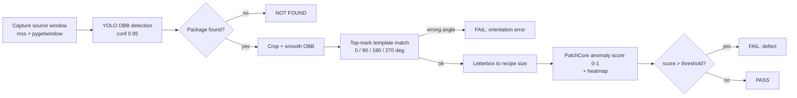
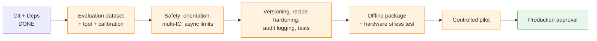

# VisionAI — Project Proposal

## Automated Visual Inspection of IC Packages

| | |
|---|---|
| **Document type** | Internal project proposal |
| **Audience** | Production owner, engineering management |
| **Date** | 2026-09-06 |
| **Status** | For stakeholder review — pilot-ready system, production approval pending |

---

## 1. Executive Summary

VisionAI is a Windows desktop application that automates the visual inspection of
IC packages. It watches a live camera feed shown in a source window, locates the
IC with a YOLO oriented-bounding-box detector, verifies the package orientation by
matching the top-mark template, and scores surface anomalies with a PatchCore
model. Each inspection ends in an explicit verdict — **PASS**, **FAIL** (with
reason and anomaly heatmap), or **NOT FOUND** — displayed live on a transparent
overlay.

The system is fully working on a development machine for the first target package
(TJA1041, SO-14): detection, orientation checking, anomaly scoring, the guided
trainer, and recipe-based configuration are all operational, backed by a pinned
offline-capable dependency set and an automated test suite. It is **not yet
production-approved**: measured accuracy on a dedicated validation set, audit
logging, model versioning, offline packaging, and hardware performance evidence
are still outstanding. This proposal asks stakeholders to approve the production
quality targets and to green-light the existing 16-gate production roadmap
(`docs/PRODUCTION_APPROVAL_ROADMAP.md`) as the path to release.

---

## 2. Problem Statement

Incoming and in-process IC inspection currently depends on manual visual checks:

- **Speed** — every package is inspected by a person, at human pace, for every lot.
- **Consistency** — verdicts vary between operators and across a shift; fatigue
  directly affects escape rate.
- **Orientation errors** — an upside-down or rotated package is a subtle,
  easy-to-miss defect that downstream assembly will not forgive.
- **Traceability** — manual inspection produces no per-part record: no score, no
  threshold, no image, no explanation. When a defect escapes, there is nothing to
  audit.
- **Scalability** — every new package type requires re-training people rather than
  re-training a model.

The goal is a repeatable, operator-assisted inspection station that catches
wrong-orientation and surface-defect parts, fails safe on anything ambiguous, and
records enough information to explain every decision after the fact.

---

## 3. Proposed Solution

VisionAI is recipe-driven: each inspected package type is described by a **recipe**
(a JSON file plus its model artifacts), so switching product lines is a selection,
not a reconfiguration.

For the operator, the workflow is:

1. Launch the inspection app and select a recipe (e.g. `TJA1041_SO14`).
2. Position packages under the camera; the feed is displayed live.
3. The overlay draws each detected package; the status widget shows the verdict,
   anomaly score, and failure reason.
4. Any non-PASS outcome is explicit: FAIL with reason (orientation error, anomaly
   score above threshold), NOT FOUND when no package is visible, or NO SOURCE /
   ERROR when the system itself is at fault — the operator can always distinguish
   "bad part" from "broken system".

New packages are added with the companion **Trainer** application from
**good images only** — no defect library is required to start. The trainer walks
the user through a guided, step-gated flow and, critically, **calibrates the
anomaly threshold from measured data** instead of a hand-picked constant.

---

## 4. How the Inspection Pipeline Works

Every ~700 ms, a dedicated worker thread runs one full cycle off the GUI thread:

| Stage | Detail |
|---|---|
| Capture | Live source window (currently a PowerPoint slide showing the camera feed), captured via `mss`; missing window reports `WAITING_SOURCE`. |
| Detection | YOLO OBB model (`models/detection/best.pt`), confidence 0.95, exponential box smoothing (α = 0.8), 1.5 s detection memory so verdicts persist while the part is stationary. |
| Orientation | Top-mark template matched at 0/90/180/270° with position-tolerant caching; a match failure **fails closed** (reports FAIL, never PASS). |
| Anomaly scoring | PatchCore (WideResNet-50-2 backbone via Anomalib) returns a 0–1 anomaly score plus an anomaly heatmap rendered on the overlay. |
| Decision | `score > anomaly_threshold` → FAIL, else PASS. The threshold is **measured**, not guessed: it is calibrated from the training set's P99 score × a safety margin. |

The current recipe `TJA1041_SO14` demonstrates the calibration in practice:
P99 = 0.394 over 147 good crops, margin 1.1 → **threshold 0.433**, with
**0 expected false alarms** on the training set, recorded as a trace block inside
the recipe.

---

## 5. System Architecture

The application is a layered PySide6 desktop app, CPU-first (no GPU required):

- **UI layer** — `ui/inspection/` (transparent overlay, status widget, recipe
  selector) and `ui/trainer/` (recipe, dataset, ROI, training, review, export,
  recommendation pages).
- **Service layer** — `services/`: `patchcore_service` (model load, scoring,
  heatmaps, folder evaluation), `recipe_service` (load/save/validate recipes),
  `top_mark_service` (orientation matching), `roi_service` (package cropping),
  `dataset_service` / `dataset_preparer` (training data preparation),
  `training_assistant` (guided-flow logic), `state_manager` (explicit system
  states: STARTING, WAITING_SOURCE, READY, DETECTING, ERROR).
- **Model artifacts** — `models/detection/best.pt` (YOLO OBB),
  `models/backbone/wide_resnet50_2/` (PatchCore backbone),
  `recipes/<PACKAGE>/model/` (PatchCore model + memory bank + metadata).
- **Utilities** — image crop/letterbox helpers, resource paths, and the pilot
  session logger (`utils/pilot_log.py`), which tees all console output into
  timestamped `runtime/logs/pilot-*.log` files (non-blocking writer, 20 sessions
  retained, falls back to the user profile if the install directory is read-only).

Recipes are validated JSON with a defined schema: package metadata
(family/type/pin count), ROI geometry statistics, model and backbone identifiers,
top-mark template path, calibrated `anomaly_threshold`, and a full `calibration`
trace block. Full architecture and user-workflow diagrams: `docs/DIAGRAMS.md`.

---

## 6. Trainer Application

`trainer_main.py` turns "add a new package" into a guided, semi-automatic flow in
which every step is checked and gated:

- **Recommendation entry** — given a new dataset, the system recommends whether to
  **reuse** an existing trained recipe, **add-to-memory** (augment), or **train a
  new model**, from metadata similarity and visual crop matching. The user always
  confirms the path.
- **Dataset intake and screening** — ≥ 300 good images recommended (warnings
  below 100); automatic screening flags blurry, over/under-exposed, and
  size-outlier images into a reviewable quarantine list (nothing is ever deleted
  without confirmation). Geometry analysis matches the package against a registry
  (the TJA1041 dataset matched SOIC / SO14 / 14 pins at score 1.0).
- **ROI auto-tune and crop QA** — crop scales and tolerances are derived from
  measured percentiles; per-crop quality classification with accept/review.
- **Training** — PatchCore trains on good crops only; a pre-flight checklist
  gates the train button.
- **Threshold calibration** — the training set is re-scored automatically; a
  histogram (min/median/P95/P99/max) proposes `threshold = P99 × margin`
  (margin adjustable, default ~1.1–1.2) and reports the **expected false-alarm
  count** before anything is applied. One click writes the threshold and its
  trace block into the recipe.
- **Finalize** — summary page bumps the recipe version and sets the validated
  flag, with a reminder to capture the top-mark template in the inspection app.

This removes the roadmap's original "arbitrary threshold" risk: no production
decision uses a hand-picked default anymore.

---

## 7. Current Status (Honest Assessment)

**Working today:**

- End-to-end inspection (capture → detect → orient → score → verdict) with live
  overlay and status widget on the development machine.
- Inference fully moved off the GUI thread (dedicated `QThread` worker, fixed
  cycle interval, signal-based UI updates) — the UI stays responsive even when
  inference is slow.
- Fail-closed orientation checking and explicit system states distinguishing
  "no part found" from "system failure".
- Measured, traceable anomaly thresholds (calibration block in the recipe).
- Pinned, offline-capable dependencies (`requirements.txt`, Python 3.11,
  CPU-only PyTorch, Anomalib 2.4.2, Ultralytics 8.4.52, PySide6 6.11.1).
- Git baseline committed (initial pre-production commit + `.gitignore`).
- Automated tests exist: cropping, dataset analysis, PatchCore contract, training
  assistant logic, offscreen widget tests (pytest).
- Pilot session logging to disk on every launch.

**Not done yet (before production release):**

- A formal, strictly separated **validation dataset** with labeled defect
  categories (defective / upside-down / wrong-package / missing).
- An **automated evaluation report** (precision, recall, confusion matrix,
  worst-case latency) — accuracy is not yet *measured*, only observed.
- Threshold validation **against real defective parts** (current calibration uses
  good-images-only self-scores).
- Orientation safety hardening (minimum match score, score-gap check, UNKNOWN
  verdict for ambiguous matches).
- Multi-IC handling (today only the highest-confidence detection is inspected).
- Model versioning with rollback, hardened recipe schema enforcement, structured
  audit logging per inspection, health monitoring.
- Offline installer (PyInstaller) tested on a clean, network-isolated production
  machine; hardware performance and long-run stability tests.
- A controlled pilot beside the existing manual inspection.

**This is exactly why `docs/PRODUCTION_APPROVAL_ROADMAP.md` currently recommends
"Do NOT approve for production yet" — and this proposal does not ask to skip it.**

---

## 8. Path to Production

The production roadmap defines 16 sequential gates. Status as of this proposal:

| # | Gate | Status |
|---|---|---|
| 1 | Git + baseline | **Done** (initial commit, `.gitignore`) |
| 2 | Dependency lock | **Mostly done** (pinned `requirements.txt`; offline-install test pending) |
| 3 | Production requirements | **Pending** — targets proposed in §9 of this document |
| 4 | Evaluation dataset | Pending |
| 5 | Automated evaluation tool | Pending |
| 6 | Threshold calibration vs. real defects | Pending (good-images calibration done) |
| 7 | Orientation + multi-object safety | Partial (fail-closed exists; UNKNOWN + multi-IC pending) |
| 8 | Async inference | **Mostly done** (worker thread live; queue limits/timeouts pending) |
| 9 | Model versioning + rollback | Pending |
| 10 | Recipe validation hardening | Partial (schema + validation flag exist; atomic writes/backups pending) |
| 11 | Logging + audit records | Partial (session logs exist; per-decision audit pending) |
| 12 | Automated tests | Partial (6 test modules; core-logic coverage to expand) |
| 13 | Offline packaging | Pending |
| 14 | Hardware stress test | Pending |
| 15 | Controlled pilot | Pending (session logging ready) |
| 16 | Production approval | **Blocked** — until gates 1–15 pass |

The roadmap's recommended order is followed as-is; several early items are
already satisfied by work completed since the roadmap was written.

---

## 9. Proposed Success Criteria

The following numeric targets are **proposed for production-owner approval**
(roadmap gate 3). They are calibrated to the current CPU-only pilot environment
and may be revised once gate-5 measurements exist.

| Criterion | Proposed target |
|---|---|
| False-pass rate (defective part judged PASS) | < 0.1% |
| False-fail rate (good part judged FAIL) | < 2% |
| Total inspection latency | < 500 ms |
| System availability | > 99% |
| Traceability | Every decision explainable after the fact (timestamp, recipe + model version, score, threshold, result) |
| Safety | Ambiguous orientation / missing template / malformed recipe **never** results in PASS |
| Recoverability | Failed model update rolls back without reinstalling the app |

Note on latency: the pipeline currently throttles to ~1.4 cycles/s by design
(700 ms interval); measured per-stage timings are a gate-5 deliverable, not an
assumption.

---

## 10. Risks and Mitigations

| Risk | Mitigation |
|---|---|
| CPU-only hardware too slow at line rate | Inference already off-thread; gate 14 measures real worst-case latency on the production machine before pilot. |
| Threshold too permissive (false passes) | Measured P99 × margin calibration with expected-false-alarm reporting; re-validated against real defective parts at gate 6; margin adjustable without code changes. |
| Ambiguous orientation passes a rotated part | Fail-closed matching already implemented; UNKNOWN verdict + score-gap checks close the gap at gate 7. |
| Multi-package scenes under-inspected | Explicit gate-8 rule: every detected IC inspected or rejected with a reason. |
| Capture source disappears or changes | `WAITING_SOURCE` state + window-title matching; health monitoring (gate 11) raises repeated failures. |
| Training data quality (blurry/duplicates) | Dataset screening with quarantine review; training blocked until validation passes. |
| Bad model update on the line | Model versioning with activate/rollback (gate 9); previous working model preserved. |
| Calibration uses training-set self-scores (optimistic) | Safety margin + pilot-line validation at gate 15 before any sign-off. |

---

## 11. Decision Requested from Stakeholders

1. **Approve the proposed production targets** in §9 (or amend them).
2. **Green-light continuation** of the production roadmap in its recommended
   order — no rewrite of the existing system is needed; it is being hardened.
3. **Nominate a production owner** and the pilot production line/lot for gate 15.
4. **Agree that production approval is granted only on pilot evidence**: the
   pilot sign-off (gate 15) is the release gate, measured against the approved
   targets.

---

## 12. References

- `docs/PRODUCTION_APPROVAL_ROADMAP.md` — 16-gate production approval plan
- `docs/DIAGRAMS.md` — technical architecture and user-workflow diagrams
- `docs/training-assistant-plan.md` — guided trainer and threshold calibration design
- `docs/pilot-ready-fixes-plan.md`, `docs/visionai-code-audit-plan.md` — hardening history
- `requirements.txt` — pinned environment (Python 3.11, Windows, CPU torch)
- `recipes/TJA1041_SO14/recipe.json` — reference recipe with calibration trace
- `main.py`, `trainer_main.py` — inspection and trainer entry points
